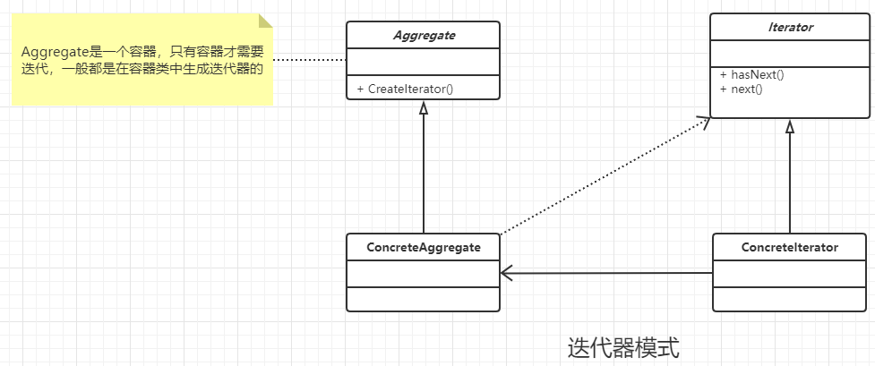

### 迭代器模式

#### 定义

提供一种方法访问一个容器对象中各个元素，而又不暴露该对象的内部细节。

ps : 只有容器才需要迭代，并且都是在容器类中生成 迭代器的。其中Jdk中已经自带迭代器模式，而且性能更好，不需要自己实现。

### 类图



### 通用代码

```java
/**
 * 抽象的迭代器模式,这里只是模拟
 * JDk已经自动实现了，而且性能更好
 *
 */
public interface Iterator {
    //获取下一个元素
    public Object next();
    //时候还有元素
    public boolean hasNext();
    //删除当前元素
    public boolean remove();
}


/**
 * 具体的 迭代器的实现类,模拟而已
 * Dk已经自动实现了，而且性能更好
 */
public class ConcreteIterator implements Iterator {
    //集合容器，不一定要是使用Vector
    private Vector vector = new Vector();
    //游标
    private int cursor = 0;


    public ConcreteIterator(Vector vector) {
        this.vector = vector;
    }

    @Override
    public Object next() {
        Object result = null;
        if (this.hasNext())
            result = this.vector.get(this.cursor++);
        else
            result = null;
        return result;
    }

    @Override
    public boolean hasNext() {
        if (this.cursor < this.vector.size())
            return true;
        else
            return false;
    }

    @Override
    public boolean remove() {
        this.vector.remove(this.cursor) ;
        return true;
    }
}


/**
 * 某个抽象的容器类,模拟
 * jdk中容器已经非常多了
 */
public interface Aggregate {
    //元素添加
    public void add(Object object);
    //减少元素
    public void remove(Object object);
    //获取迭代器
    public Iterator iterator();
}


/**
 * 某个具体的容器类
 */
public class ConcreteAggregate implements Aggregate {
    //容纳对象的容器
    private Vector vector = new Vector();

    @Override
    public void add(Object object) {
        this.vector.add(object);
    }

    @Override
    public void remove(Object object) {
        this.vector.remove(object);
    }

    @Override
    public Iterator iterator() {
        return new ConcreteIterator(this.vector);
    }
}


/**
 *
 */
public class Client {
    public static void main(String[] args) {
        Aggregate aggregate = new ConcreteAggregate();
        aggregate.add("111");
        aggregate.add("222");
        aggregate.add("333");
        Iterator iterator = aggregate.iterator();
        while (iterator.hasNext())
            System.out.println(iterator.next());
    }
}

```


### 优点

- 不关心容器类型
- 不要暴露对象细节

### 使用场景

基本上市面上的高级语言就已经继承了迭代器模式了，因此可以直接用就好。