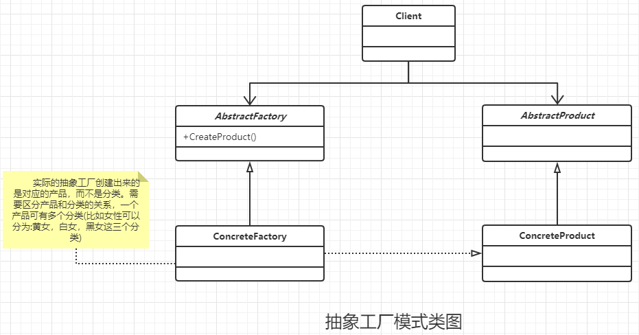

### 抽象工厂模式

#### 定义

为创建一组相关或者相关依赖的对象提供一个接口，而且必须制定他们的具体类。

#### 类图




#### 通用代码

```java
/**
 * 抽象产品A
 */
public abstract class AbstractProductA {

    //A产品的公用方法
    public void shareMethod() {

    }

    //每个产品个性的方法
    public abstract void doSpecialMethod();
}


/**
 * 产品A的其中一个分类
 */
public class ProductAA extends AbstractProductA {
    //特殊的处理逻辑
    @Override
    public void doSpecialMethod() {

    }
}

/**
 * A产品的另一个分类
 */
public class ProductAB extends AbstractProductA {
    @Override
    public void doSpecialMethod() {

    }
}


/**
 * 抽象产品B
 */
public abstract class AbstractProductB {
    //A产品的公用方法
    public void shareMethod() {

    }

    //每个产品个性的方法
    public abstract void doSpecialMethod();
}

/**
 * B产品的一个分类
 */
public class ProductBA extends AbstractProductB {
    //比较特殊的处理逻辑
    @Override
    public void doSpecialMethod() {

    }
}

/**
 * B产品的一个分类
 */
public class ProductBB extends AbstractProductB {
    //比较特殊的处理逻辑
    @Override
    public void doSpecialMethod() {

    }
}


/**
 * 抽象工厂类,是以产品为维度进行划分的
 */
public abstract class AbstractCreator {
    //创建A类产品
    public abstract AbstractProductA createProductA();
    //创建B类产品
    public abstract AbstractProductB createProductB();
}


/**
 * 抽象工程的实现类,只是负责创建产品的A分类
 */
public class CreatorA extends AbstractCreator {
    @Override
    public AbstractProductA createProductA() {
        return new ProductAA();
    }

    @Override
    public AbstractProductB createProductB() {
        return new ProductBA();
    }
}

/**
 * 抽象工程的实现类,只是负责创建产品的B分类
 */
public class CreatorB extends AbstractCreator {
    @Override
    public AbstractProductA createProductA() {
        return new ProductAB();
    }

    @Override
    public AbstractProductB createProductB() {
        return new ProductBB();
    }
}


public class Client {
    public static void main(String[] args) {

        AbstractCreator creatorA = new CreatorA(); 
        AbstractCreator creatorB = new CreatorB(); 
        //产生A产品的不同分类
        AbstractProductA productAA = creatorA.createProductA();
        AbstractProductA productAB = creatorB.createProductA();
        //产生B产品的不同分类
        AbstractProductB productBA = creatorA.createProductB();
        creatorB.createProductB()
    }
}
```

#### 优点

- 良好的封装性和解耦性，高层模块不需要关系对象的创建工作，只是负责使用。
- 可以更好的管理分类之间的约束状态。

#### 缺点

- 产品类的扩展改动非常的大。

#### 使用场景

一个对象族或者(一组没有任务关系的对象)都有着相同的约束，就可以使用抽象工厂模式。