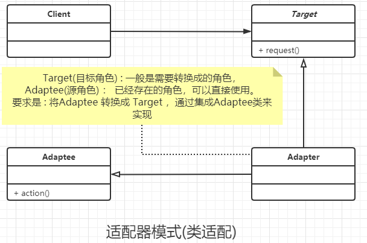
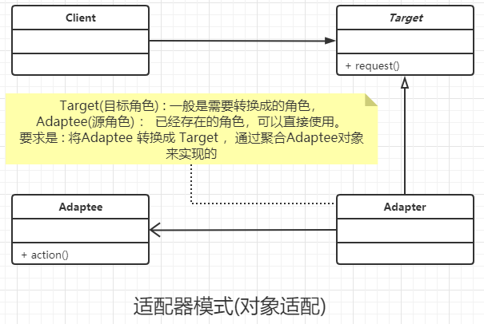

### 适配器模式

#### 定义

将一个类的接口变换成客户端所期望的另一种接口，从而使原本因接口不匹配而无法在一起工作的两个类能够在一起工作。

##### 类适配

通过继承 源角色 类 并且 实现 目标接口 的方式 来达标目的。 通过类间继承的方式。

##### 对象适配

通过 聚合(组合) 源角色 对象 并且 实现 目标接口 的方式 来达到 目的。 通过对象 组合 (关联，聚合) 的方式。

#### 说明

- 主要是通过继承已有的类(src)，实现目标接口(dst)。(比如: 各国插头标准不一样，在外国旅游,只有国内的插头，国外插头是已有的类(src)，适配器是继承国外标准(src)，输入国内插头标准(dst))。
- 核心思想 :  两个类型不同的 类 A , B , 类A 想使用 类B 的功能。但是不想重复开发，或者其他原因，实现不了。

### 类图






### 通用代码

```java
/**
 * 目标角色，也就是我们期望角色，
 * <p>
 * 需要将其他角色转换成目标角色才行
 */
public interface Target {
    //目标角色有自己的方法
    public void request();
}


/**
 * 具体的目标角色
 */
public class ConcreteTarget implements Target {
    @Override
    public void request() {
        System.out.println("具体的目标角色的实现类");
    }
}


/**
 * 这是源角色，也就是已经存在的角色，可以直接拿来使用的角色(不需要创建的),
 * 一般情况下他是一个类,直接用就好。
 * ps : 如果非要创建一个新的源角色，套用适配器模式也是可以的
 */
public class Adaptee {
    //原有的业务逻辑
    public void action(){
        System.out.println("源角色的实现方法，直接用的");
    }
}


/**
 * 类适配模式:
 * 一般是通过继承源角色，实现目标角色，
 * 这样就转换成需要的目标角色了
 */
public class AdapterClass extends Adaptee implements Target {
    @Override
    public void request() {
        super.action();
    }
}


/**
 * 对象适配模式:
 * 实现方式 : 实现目标角色，聚合所有的源角色的对象，来达到目标
 * 比较适合源角色是多个的情况，这种情况下不适合继承
 */
public class AdapterObject implements Target {
    private Adaptee adaptee;

    public AdapterObject(Adaptee adaptee) {
        this.adaptee = adaptee;
    }

    @Override
    public void request() {
        this.adaptee.action();
    }
}


/**
 * 目标客户端
 */
public class Client {
    public static void main(String[] args) {
        Target oriTarget = new ConcreteTarget();
        oriTarget.request();
        Target classTarget = new AdapterClass();
        classTarget.request();
        Target objectTarget = new AdapterObject(new Adaptee());
        objectTarget.request();
    }
}


```


### 优点

- 通过是适配器 类 可以将两个毫无关系的对象 放在一起使用
- 增加类间透明度。 高层模块不管 对象是target 还是  adaptee
- 提高类的复用。  target就是复用 adaptee的。

#### Java中的实际使用场景

SpringMVC 开发中，经常使用到了 对象适配器模式 ， 比如controller 和 service(算目标接口,impl算适配器) 就可以算是对象适配模式了。

### 使用场景

- 修改一个已经投入生成的接口时，就可以使用适配器模式
- 系统刚开始时是不需要 适配器模式的， 一般适配器模式都是作为后悔药使用的。