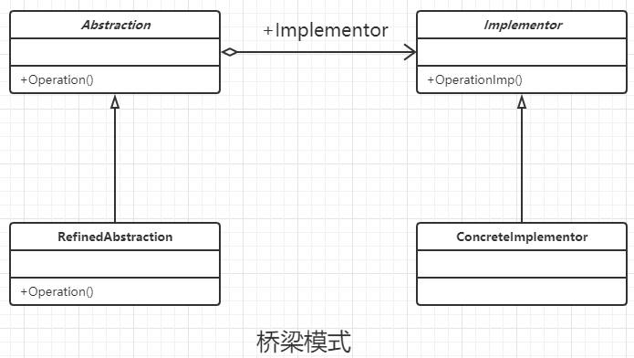

### 桥梁模式

#### 定义

将抽象和实现解耦，使得两者可以独立的变化。

#### 类图



#### 通用代码

```java
/**
 * 抽象的产品类， 只是定义抽象的方法
 */
public interface Implementor {
    //抽象的行为方法
    public void doSomething();

    public void doAnything();
}


/**
 * 具体的产品类。实现对应的逻辑
 */
public class ConcreteImplementorA implements Implementor {
    @Override
    public void doSomething() {

    }

    @Override
    public void doAnything() {

    }
}


/**
 * 具体的产品类。实现对应的逻辑
 */
public class ConcreteImplementorB implements Implementor {
    @Override
    public void doSomething() {

    }

    @Override
    public void doAnything() {

    }
}


/**
 * 类似于工坊的存在，给产品生产提供场地等资源的支持
 */
public abstract class Abstraction {
    //定义对应的产品类对象
    private Implementor implementor;

    public Abstraction(Implementor implementor) {
        this.implementor = implementor;
    }

    //自身的行为和属性
    public void request() {
        this.implementor.doSomething();
    }

    //获得实现化角色
    public Implementor getImplementor() {
        return this.implementor;
    }
}


/**
 * 某个具体的工坊类，每个工坊所能提供的材料是不一样的
 */
public class RefinedAbstraction extends Abstraction {
    //复写对应的构造函数
    public RefinedAbstraction(Implementor implementor) {
        super(implementor);
    }

    /**
     * 还可以添加父类的修改逻辑
     */
    @Override
    public void request() {
        super.request();
    }
}


/**
 * 场景类
 */
public class Client {
    public static void main(String[] args) {
        //定义一个实现化角色
        Implementor implementor = new ConcreteImplementorA();
        Abstraction abstraction = new RefinedAbstraction(implementor);
        abstraction.request();
    }
}


```

#### 优点

- 抽象和实现分离。
- 优秀的扩展能力。比如增加新的工坊和产品类非常的方便。
- 实现细节透明

#### 实习场景

- 不希望或者不是适合实用继承的场景。
- 接口或者抽象类不稳定的场景。
- 重用性要求比较高的场景。

#### 注意事项

桥梁模式主要考虑如果拆分抽象和具体的实现，而不是考虑舍弃继承。桥梁模式的意图还是对变化的封装，尽量把可能变化的因素封装到最细、最小的逻辑单元中，避免风险扩散。当继承超过N的时候，可以考虑使用桥梁模式。