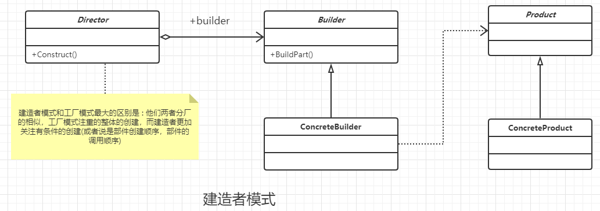

### 建造者模式

#### 定义

将一个复杂对象的创建与它的表示分离，使得同样的构建过程可以创建不同的表示。

#### 类图



#### 通用代码

```java
/**
 * 抽闲产品类
 */
public abstract class AbstractProduct {
    //共有的逻辑
    public void shareMethod(){

    }
    //特殊的处理逻辑
    public abstract void doSomething();
}


/**
 * 具体的实现类
 */
public class ConcreteProduct extends AbstractProduct{
    //特殊的实现逻辑
    @Override
    public void doSomething() {
      //to do
    }
}


/**
 * 抽象的建造者类
 */
public abstract class AbstractBuilder {
    //设置不同的产品类型
    public abstract void setPart();
    //建造产品
    public abstract AbstractProduct builderProduct();
}


/**
 *具体的实现类
 */
public class ConcreteBuilder extends AbstractBuilder {
    private AbstractProduct abstractProduct = new ConcreteProduct();

    /**
     * 设置产品的零部件，调用具体的产品内部逻辑
     */
    @Override
    public void setPart() {
        abstractProduct.doSomething();
    }

    /**
     *
     * 返回对应的一个产品，并不是是写的成员变量。这里只是为了方便
     * 所以返回一个产品
     */
    @Override
    public AbstractProduct builderProduct() {
        return abstractProduct;
    }
}


/**
 * 导演类,可以有多个，
 */
public class Director {
    private AbstractBuilder builder = new ConcreteBuilder();

    //构建不同的产品
    public AbstractProduct getAProduct() {
        /**
         * 设置不同的零件，产生不同的产品
         */
        builder.setPart();
        return builder.builderProduct();
    }
}
```


#### 优点

- 封装性，高层模块不要知道产品组装的细节。
- 建造者独立，容易扩展。
- 便于控制细节风险。像修改创建过程，只需要修改建造者就行。

#### 注意事项

建造者更加关注的是零件类型和装配工艺(顺序)。 这是它和工厂模式最大的区别。工厂模式和建造者模式非常的类似。

#### 使用场景

- 相同的方法，不同的执行顺序，产生不同的事件结果。可以采用建造者模式。
- 多个部件或者零件，都可以转配到一个对象中，但是产生的运行结果又不相同时，可以使用该模式。
- 产品类非常复杂，或者产品类中的调用顺序不同而产生的了不同的效能。