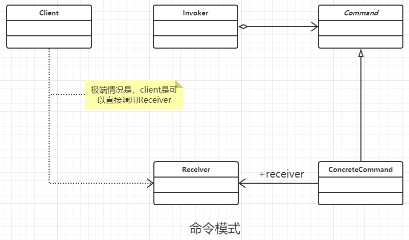

### 命令模式

#### 定义

让一个请求封装成一个对象，从而使用不同的请求把客户端参数化，队请求排队或者记录请求日志，可以提供命令的撤销和恢复功能。

#### 类图



#### 通用代理

```java
/**
 * 抽象的接受者，也就是实际的命令执行者，
 * 就像小喽啰
 */
public abstract class Receiver {
    public abstract void doSomething();
}


/**
 * 具体的接受场景,小兵A
 */
public class ConcreteReceiverA extends Receiver {
    @Override
    public void doSomething() {

    }
}


/**
 * 具体的接受场景,小兵B
 */
public class ConcreteReceiverB extends Receiver {
    @Override
    public void doSomething() {

    }
}


/**
 * 抽象命令模式
 */
public abstract class Command {
    public abstract void exection();
}


/**
 * 具体的命令模式A
 */
public class ConcreteCommandA extends Command {
    //执行类
    private Receiver receiver;

    public ConcreteCommandA(Receiver receiver) {
        this.receiver = receiver;
    }

    @Override
    public void exection() {
        this.receiver.doSomething();
    }
}


/**
 * 具体的命令模式A
 */
public class ConcreteCommandB extends Command {
    //执行类
    private Receiver receiver;

    public ConcreteCommandB(Receiver receiver) {
        this.receiver = receiver;
    }

    @Override
    public void exection() {
        this.receiver.doSomething();
    }
}


/**
 * 调用者， 对应命令的请求者，
 * 命令请求和命令执行是分开的 ,
 * 其中调用者可以省略，
 * 就是原始状态的那种
 */
public class Invoker {
    private Command command;

    public void setCommand(Command command) {
        this.command = command;
    }

    public void action() {
        this.command.exection();
    }
}


/**
 * 客户端
 */
public class Client {
    public static void main(String[] args) {
        //调用者和请求者
        Invoker invoker = new Invoker();
        //定义接受者
        Receiver receiver = new ConcreteReceiverA();
        //命令
        Command command = new ConcreteCommandA(receiver);
        invoker.setCommand(command);
        invoker.action();
    }
}


```

#### 优点

- 类间解耦， 调用者 和 接受者之间没有依赖关系
- 可扩展性 ， 命令的扩展非常的方便

#### 缺点

 命令的子类膨胀的非常严重，如果命令非常多的话。

#### 使用场景

只要有命令的地方都可以使用命令模式。比如 图形界面 GUI开发的命令， DOS命令等。

