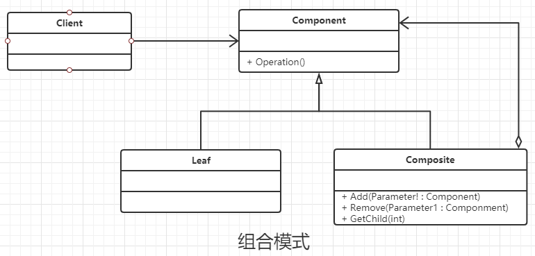

### 组合模式

#### 定义

将对象组合成树形结构以表示 “部分-整体”的层次结构，使得对单个对象和组合对象的使用具有一致性

#### 类图



#### 通用代码

```java
/**
 * 抽象的构件，包含一些基础功能
 */
public abstract class Component {
    //通用的业务逻辑
    public void doSomething() {
        //业务的编写
    }
}


/**
 * 基础节点，相当于二叉树中的叶子节点
 */
public class Leaf extends Component {
    /**
     * 基本上 叶子的节点的功能在 抽象构件 中已经实现，
     * 当然也可以复写父类中的方法
     */
}


/**
 * 树杈节点，相当于二叉树中非叶子节点(双亲节点)，
 */
public class Composite extends Component {
    //通常情况下包含一些基本的构件
    private ArrayList<Component> components = new ArrayList<Component>();

    //可以增加节点
    public void add(Component component) {
        this.components.add(component);
    }

    //删除叶子节点
    public void remove(Component component) {
        this.components.remove(component);
    }

    //获得某个分支节点
    public ArrayList<Component> getChildren() {
        return this.components;
    }
}


public class Client {

    public static void main(String[] args) {
        //根节点
        Composite root = new Composite();
        root.doSomething();
        //双亲节点
        Composite branch = new Composite();
        Leaf leaf = new Leaf();
        root.add(branch);
        branch.add(leaf);
        dispaly(root);
    }

    public static void dispaly(Component root) {
        root.doSomething();
        if (root instanceof Composite)
            for (Component component : ((Composite) root).getChildren())
                dispaly(component);
    }
}
```

#### 优点

- 高层模块调用简单
- 节点自由增加

#### 缺点

- 违反了依赖倒置的原则

#### Java中的使用场景

 HashMap的设计包含了组合模式，其中 Map 作为抽象的构件， Map中的作为抽象的构件，Map中的Entry及其子类作为 基础的叶子节点， HashMap 作为 树枝或者根节点的角色。从put 或者 putAll 等方法，都是通过调用Entry 及其子类来完成的。而Entry及其子类只有基础的 getValue 和 setValue 等方法。

#### 使用场景

- 维护和展示 部分-整体 关系的场景，如树形菜单，文件和文件夹管理。
- 从一个整体中能够独立出部分模块活功能的场景。

