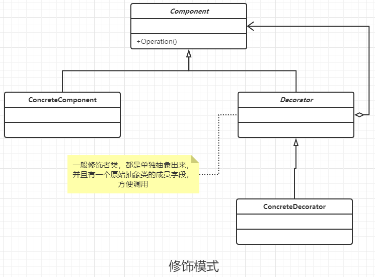

### 装饰模式

#### 定义

动态的给一个对象添加一些额外的职责。就添加功能来说，装饰模式相对比生成子类更加灵活。

#### 说明

- Decorator 是装饰者的 父类 ，一般是会聚合一个Component实例。可能ConcreteComponent 在 Component 下面还有一个抽象父类.

#### 类图



#### 通用代码

```java
/**
 * 抽象的构件
 */
public abstract class Component {
    //抽象方法啊
    public abstract void operate();
}


/**
 * 具体的组件类
 */
public class ConcreteComponent extends Component {

    @Override
    public void operate() {
        System.out.println("do somethig");
    }
}


/**
 * 抽象的装饰，不适用原始的抽象类，而但是抽象装饰罩出来是为了更方便的扩展
 */
public abstract class Decorator extends Component {
    private Component component;

    public Decorator(Component component) {
        this.component = component;
    }

    //实际上还是委托给实际的类进行处理
    @Override
    public void operate() {
        this.component.operate();
    }
}


/**
 * 具体的修饰
 */
public class ConcreteDecoratorA extends Decorator {
    //显示初始化修饰着
    public ConcreteDecoratorA(Component component) {
        super(component);
    }

    //特有的修饰方法
    private void method1() {

    }

    //调用父类的修饰方法,并重写
    @Override
    public void operate() {
        this.method1();
        super.operate();
    }
}


/**
 * 具体的修饰
 */
public class ConcreteDecoratorB extends Decorator {
    //显示初始化修饰着
    public ConcreteDecoratorB(Component component) {
        super(component);
    }

    //特有的修饰方法
    private void method2() {

    }

    //调用父类的修饰方法,并重写
    @Override
    public void operate() {
        this.method2();
        super.operate();
    }
}


public class Client {
    public static void main(String[] args) {
        Component component = new ConcreteComponent();
        //第一次修饰
        component = new ConcreteDecoratorA(component);
        //第二次修饰
        component = new ConcreteDecoratorB(component);
        component.operate();
    }
}

```

#### 优点

- 装饰者类 和 被装饰者类可以独立发展，不会耦合。可以相互解耦，两者之间不会知道彼此。
- 装饰者模式 是继承关系的一种替代方案 。
- 装饰者模式可以动态扩展一个类的功能。

#### 缺点

- 多层装饰代码比较复杂，增加阅读和调试的工作量

#### Java中的使用场景

IO操作就是典型的装饰者模式，其中抽象组件类 InputStream 是这个，需要修饰的这个 可有 FileInputStream, ByteArrayInputStream , 修饰者父类为 FilterInputStream(包含一个InputStream 成员变量)， 具体的修饰者有 BufferedInputStream,DataInputStream。

#### 使用场景

- 需要扩展一个类的功能，或者给一个类增加附加功能
- 动态的为一个对象增加功能，能动态撤销
- 需要为一批兄弟类进行改装或者加装功能，装饰模式非常不错。