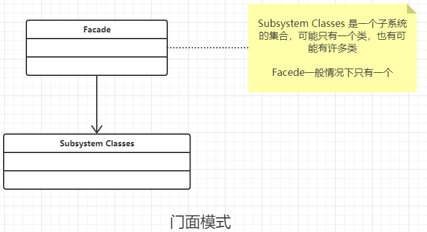

### 门面模式

#### 定义

要求一个子系统的外部与内部通信必须通过一个统一的对象进行，门面模式提供一个高层次的接口，使得子系统更好使用。

ps : 

- 子系统有可能只有一个对象，也有可能有多个对象.
- 门面对象中应该不包含业务逻辑的 也就是一个方法只是提供访问子系统的通道而已,不应该包含 if,else 等等的业务逻辑 ,  哪怕是一个方法中调用超过一个对象的方法就已经掺杂业务逻辑了，正确的做法是应该把  这些业务逻辑放弃另一个类中 , 门面只是调用另一个类的结果就好。
- 高层模块权限不同，应该提供不同的的门面对象，不能再一个门面对象中判断。
- 一般一个子系统只有一个门面对象，除非发生上面说的事情。

#### 类图



#### 通用代码

```java
/**
 * 子系统的中的 一个对象，
 * 子系统有可能只有一个对象，也有可能有多个对象
 */
public class ClassA {
    public void doSomethingA(){
        //具体的业务逻辑
    }
}


/**
 * 子系统的中的 一个对象，
 * 子系统有可能只有一个对象，也有可能有多个对象
 */
public class ClassB {
    public void doSomethingB(){
        //具体的业务逻辑
    }
}


/**
 * 子系统的中的 一个对象，
 * 子系统有可能只有一个对象，也有可能有多个对象
 */
public class ClassC {
    public void doSomethingC(){
        //具体的业务逻辑
    }
}


/**
 * 掺杂业务的处理方式
 */
public class FacadeContext {
    private ClassA classA = new ClassA();
    private ClassB classB = new ClassB();

    //业务处理
    public void complexMethod(){
        this.classA.doSomethingA();
        this.classB.doSomethingB();
    }
}


/**
 * 按照道理，门面对象中应该不包含业务逻辑的
 * 也就是一个方法只是提供访问子系统的通道而已
 * 不应该包含 if,else 等等的业务逻辑
 * 哪怕是一个方法中调用超过一个对象的方法就已经掺杂
 * 业务逻辑了，正确的做法是应该把  这些业务逻辑放弃另一个类中
 * 门面只是调用另一个类的结果就好。
 * <p>
 * 高层模块权限不同，应该提供不同的的门面对象，不能再一个门面对象中判断
 */
public class Facade {
    private ClassA classA = new ClassA();
    private ClassB classB = new ClassB();
    private ClassC classC = new ClassC();
    private FacadeContext facadeContext = new FacadeContext();

    //对外提供A的方法
    public void methodA() {
        this.classA.doSomethingA();
    }

    //对外提供B的方法
    public void methodB() {
        this.classB.doSomethingB();
    }

    //对外提供C的方法
    public void methodC() {
        this.classC.doSomethingC();
    }

    //对外提供A和B业务的的方法,因为有包含业务了
    public void methodAB() {
        this.facadeContext.complexMethod();
    }
}


/**
 * 高层模块权限不同，只能看对象B的方法
 */
public class Facade2 {

    private ClassB classB = new ClassB();

    //对外提供B的访问方法
    public void methodB() {
        this.classB.doSomethingB();
    }
}

```

#### 优点

- 减少系统的相互依赖，高层只需要依赖门面对象就好
- 提供灵活性， 高层不关心底层实现
- 提高安全性。

#### 缺点

- 不符合开闭原则。 因为有变动只能修改，没有办法扩展。

#### 使用场景

- 为了负责系统或者子系统提供一个外接访问接口
- 子系统要求相对独立。比如 利息计算问题。 这种只有专业知识的人才懂的计算，只需要提供一个门面就好
- 预防低水平的人员带来的风险扩散。 让其在他的子系统中开发，不影响整个系统。