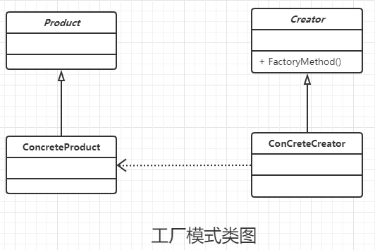

### 工程模式

#### 定义

定义一个用于创建对象的接口，让子类决定实例化那一个类。工厂方法会是一个类的实例化延迟到其子类。

#### 类图



#### 通用代码

```java
/**
 * 通过的产品类接口,可以考虑接口，抽象类
 * 也可以考虑一个接口，多个抽象类，每个抽象类都有一个实现类
 */
public abstract class Product {
    //产品的公共方法
    public void method1(){
        //公有逻辑处理
    }

    //抽象方法
    public abstract void method2();
}


/**
 * 产品类的具体实例
 */
public class ConcreteProduct1 extends Product {
    @Override
    public void method2() {
        //产品的特定需求
    }
}


/**
 * 产品类的具体实例
 */
public class ConcreteProduct2 extends Product {
    @Override
    public void method2() {
        //产品的特定需求
    }
}


/**
 * 抽象的工厂接口
 */
public abstract class Creator {
    /**
     * 创建一个产品对象，输入的参数类型可以自行设置
     * 一般使用String, Enum, Class等
     */
    public abstract <T extends Product> T createProduct(Class<T> c);
}


/**
 * 工厂接口的某个实现子类，可以有很多个子类
 */
public class ConcreteCreator extends Creator {

    /**
     * 简单使用，调用无参数的构造函数
     */
    @Override
    public <T extends Product> T createProduct(Class<T> c) {
        Product product = null;
        try {
            product = (Product) Class.forName(c.getName()).newInstance();
        } catch (Exception e) {
            e.printStackTrace();
        }
        return (T) product;
    }
}


/**
 * 高层模块
 */
public class Client {
    public static void main(String[] args) {
        Creator creator = new ConcreteCreator();
        Product product = creator.createProduct(ConcreteProduct1.class);
        //业务逻辑
        product.method1();
        product.method2();
    }
}

```


#### 优点

- 工厂模式良好的封装性，代码结构清晰，并且扩展性是非的优秀。
- 工厂模式屏蔽了产品类是一个非常经典的解耦操作。

#### 缺点

- 如果一味得为每个类创建一个工厂模式的话，会造成子类的暴涨。

#### 使用场景

其实只要使用new的地方都可以使用工厂模式，但是增加工厂模式的时候慎重，因为非常有可能造成代码的膨胀。