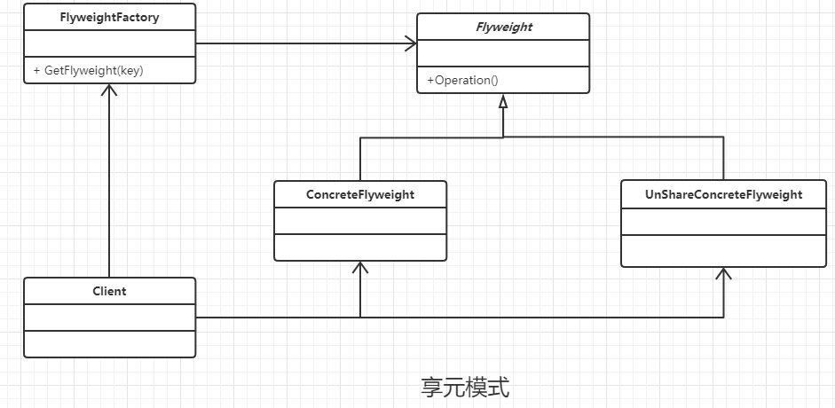

### 享元模式

#### 定义

使用共享对象可有效支持大量的细粒度的对象。

#### 一些额外的知识点

- 使用对象的 属性 复写  equals() 和 hashCode(），其实比较的效率，没有 Java基本类型(包括String)快。
- 享元对象可以分为两种状态: 内部状态 ，外部状态 (可以看看代码解释)。
  - 内部状态 : 对象可以共享的信息，存储在对象内部并且不会 随着环境改变而改变 。
  - 外部状态 : 外部状态对象可以依赖的一种标识,随着环境的改变而改变， 是不可以共享的状态。是一个对象的唯一索引值, 外部对象可以用final修饰。
- 享元对象是存在线程安全性问题的，所以就需要足够多的享元对象才行。

#### 类图



#### 实例代码

```java
/**
 * 抽象的享元角色
 */
public abstract class Flyweight {
    //内部状态
    private String intrinsic;
    //外部状态
    private final String Extrinsic;

    //要求享元角色必须接受外部状态
    public Flyweight(String extrinsic) {
        Extrinsic = extrinsic;
    }

    //定义业务操作
    public abstract void operate();

    //内部状态的getter / setter
    public String getIntrinsic() {
        return intrinsic;
    }

    public void setIntrinsic(String intrinsic) {
        this.intrinsic = intrinsic;
    }
}


/**
 * 具体的享元角色
 */
public class ConcreteFlyweight1 extends Flyweight {
    //外部状态不能被改变
    public ConcreteFlyweight1(String extrinsic) {
        super(extrinsic);
    }

    //更加外部状态进行逻辑处理
    @Override
    public void operate() {

    }
}


/**
 * 具体的享元角色
 */
public class ConcreteFlyweight2 extends Flyweight {
    //外部状态不能被改变
    public ConcreteFlyweight2(String extrinsic) {
        super(extrinsic);
    }

    //更加外部状态进行逻辑处理
    @Override
    public void operate() {

    }
}


/**
 * 带有容器池的工厂模式
 */
public class FlyweightFactory {

    //缓存池，或者容器池
    private static Map<String, Flyweight> pool = new HashMap<String, Flyweight>();

    //从池中获得对象
    public static Flyweight getSignInfo(String key) {
        //返回对象
        Flyweight result = null;
        /**
         * 这里不使用SignInfo的subject 和 location复写equals 和 hashCode
         * 方法，是因为他们的效率比较的效率 其实没有 Java基本类型(包括String)快
         */
        if (!pool.containsKey(key)) {
            result = new ConcreteFlyweight1(key);
            pool.put(key, result);
        } else {
            result = pool.get(key);
        }
        return result;
    }
}
```

#### 优点

- 减少对象的创建，
- 降低程序的内存使用

#### 缺点

- 提高了系统复杂性
- 分离出外部状态和内部状态，而且外部状态具有固化特性，不应该随内部状态改变而改变，否则导致系统的逻辑混乱。

#### 使用场景

- 系统中存在大量的相似对象
- 需要缓冲池的场景