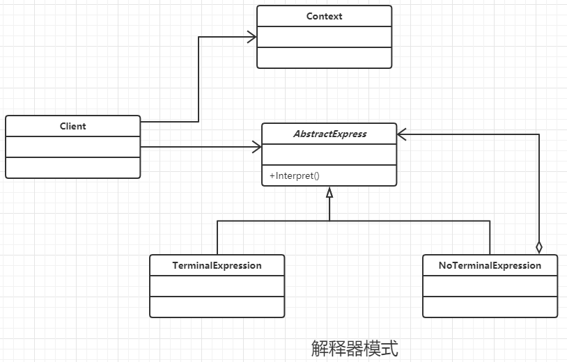

### 解释器模式

#### 定义

给定一门语言，定义它的文法的一种表示，并定义一个解释器，该解释器使用该表示来解释语言中的句子。

#### 类图



#### 通用代码

```java
/**
 * 表达式上下文，用于存放相关的信息
 */
public class Context {
}


/**
 * 抽象表达式类，在表达式中只分为 终结符表达式 或者 非终结符表达式
 * 终结符表达式 比如数字或者公式中的变量
 * 非终结符表达式 比如加减等操作符
 */
public abstract class Expression {
    //按照道理来说，每个表达式必须有一个解析任务
    public abstract Object interpreter(Context ctx);
}


/**
 * 终结符表达式
 */
public class TerminalExpression extends Expression{
    //通常终结符表达式只有一个，但是有多个对象
    public Object interpreter(Context ctx) {
        return null;
    }
}


/**
 * 非终结符表达式
 */
public class NonterminalExpression extends Expression{
    //每个非终结符表达式都会对其他表达式产生依赖
    public NonterminalExpression(Expression... expression) {
    }

    public Object interpreter(Context ctx) {
        //进行文法处理
        return null;
    }
}


/**
 * 客户端类
 */
public class Client {
    public static void main(String[] args) {
        Context ctx = new Context();
        //通常定一个语法容器，容纳一个具体的表达式，通常为ListArray、LinkedList、Stack等类型
        Stack<Expression> stack = null;
        boolean isbreak = true;
        for (; isbreak; ) {
            //进行语法判断，并产生递归调用
        }
        //产生一个完整的语法树，由各个具体的语法分析进行解析
        Expression exp = stack.pop();
        //具体元素进入场景
        exp.interpreter(ctx);
    }
}
```

#### 优点

解释器是一个简单语法分析工具，优点是扩展性。 扩展语法和非终结符 都是 修改对应的终结符类，这样就比较简单了。

#### 缺点

- 解释器模式会导致类膨胀，非终结符类太多。
- 解释器模式采用递归调用方式

#### 注意事项

尽量不要使用解释器模式，因为维护工作量太大了。

