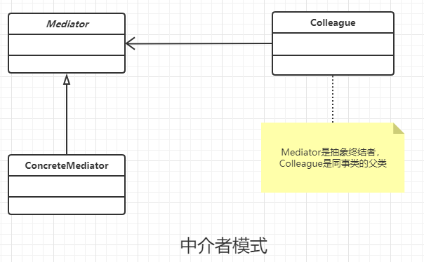

### 中介者模式

#### 定义

用一个中介对象封装一系列的对象交互，中介者使各个对象不需要显示的相互作用，从而使其松耦合，而且可以独立的改变他们之间的交互。

#### 类图



#### 通用代码

```java
/**
 * 抽象的同事类，用于和抽象的中介者分开来
 */
public abstract class Colleague {
    protected Mediator mediator;
    //强制子类要注入中介者，如果有其他方式也是可以的
    public Colleague(Mediator mediator) {
        this.mediator = mediator;
    }
}

/**
 * 具体的同事类
 */
public class ConcreteColleagueA extends Colleague {

    public ConcreteColleagueA(Mediator mediator) {
        super(mediator);
    }

    //自己的业务逻辑
    public void selfMethodA() {

    }

    //依赖中介者的业务逻辑
    public void depMethodA() {
        super.mediator.doSomethingA();
    }
}


/**
 * 具体的同事类2
 */
public class ConcreteColleagueB extends Colleague {
    public ConcreteColleagueB(Mediator mediator) {
        super(mediator);
    }

    //自己的业务逻辑
    public void selfMethodB() {

    }

    //依赖中介者的业务逻辑
    public void depMethodB() {
        super.mediator.doSomethingB();
    }
}


/**
 * 具体的中介者代码
 */
public class ConcreteMediator extends Mediator {
    @Override
    public void doSomethingA() {
        super.concreteColleagueA.selfMethodA();
        super.concreteColleagueB.depMethodB();
    }

    @Override
    public void doSomethingB() {
        super.concreteColleagueB.selfMethodB();
        super.concreteColleagueA.depMethodA();
    }
}
```


#### 优点

中介者模式减少了类之间的依赖，也就是降低类间的耦合。 比如对象原本是一对多的依赖关系变成了一对一的依赖。

#### 缺点

中介者代码膨胀的非常快，而且逻辑复杂。同事类越多，中介者的逻辑就越复杂。

#### 使用场景

中介者模式非常容易被滥用，因为代码之间必定会有耦合的。中介者模式的加入，必然使得中介者对象逻辑非常复杂。一般只有对象类图之间出现 蜘蛛网状结构 ，才考虑使用中介者模式。

#### 实际应用

- 机场调度中心。  飞机的起飞降落，需要通过机场的调度中心
- MVC 框架 。其中C 就是一个中介者。 复杂将 V 和 M 隔离开来，同时协助M 和 V 的工作。
- 媒体网关。 MSN等即时通讯软件。 就是通过服务器传递消息的。
- 中介服务。 对应现实中的中介。