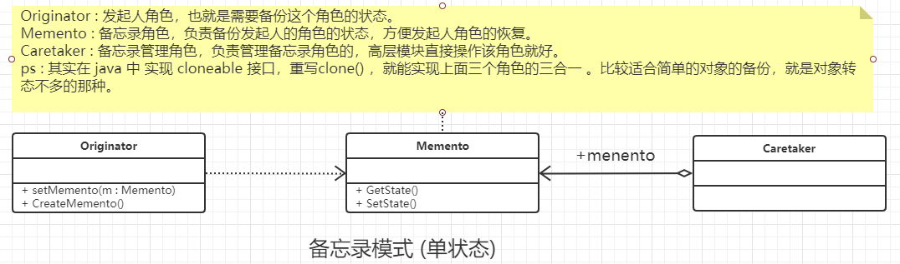

### 备忘录模式

#### 定义

在不破坏封装性的前提下，捕获一个对象的内部状态，并在该对象之外保存这个状态。这样以后就可将该对象恢复到原先保存的状态。

ps : 涉及模式出现时间比较早，后面出现的高级语言是可以在该对象内部 保存自己的转态的，比如java的clone或者序列化都是可以保存该对象的状态的。 为了安全性考虑还可以使用内部类的方式。

#### 其他

实际操作的时候发现几个问题，因此记录一下：

- 首先Java的序列化，因为涉及到了改变数据结构(将对象变成 了数组)，因此用的是 ObjectOutputStream 和  ByteArrayOutputStream 。 读对象则相反。
- Java 深度拷贝对象性能比较 : clone > new > Serializable > Json序列化。 每种序列化的优缺点 : 
  - clone 需要实现 Cloneable  接口，并且需要复写clone() ，需要主要浅克隆和深克隆之间的关系
  - new 的性能比 clone 稍差，不要实现接口，需要自己手动或者借助第三方工具库 实现setter，如果某个属性是 对象(*像List这类的，如果List中的元素是对象，结果是和List一样*)，赋值过去的任然是引用。
  - Serializable  涉及到IO操作，所以及较慢，对象需要实现 Serializable  ,不需要复写方法，不过都是深克隆，不存在浅克隆的问题
  -  Json序列化 : 同样涉及到IO操作，对 对象没有要求 ，对象都是深克隆，其他没有什么要求了
- 反射 获取到的对象属性，任然是一个引用。
- 同级的外部对象创建的内部类是可以彼此相互使用的, 外部类实例A ,外部类实例B 都可以使用 A 创建的内部类对象C, 尽管C的外部类指针任然指向A。


#### 类图



#### 通用代码

```java
/**
 * 发起角色， 也就是需要备份这个角色的状态
 * <p>
 * ps: 因为java语言的优越性，其实发起角色人，
 * 备忘录角色，备忘录管理角色 这三个可以融为一体，
 * 详细的可以看扩展。
 */
public class Originator {
    //内部状态
    private String state;

    //getter和setter
    public String getState() {
        return state;
    }

    public void setState(String state) {
        this.state = state;
    }

    //创建一个备忘录
    public Memento createMemento() {
        return new Memento(this.state);
    }

    //备忘录角色的恢复
    public void restoreMemento(Memento memento) {
        this.setState(memento.getState());
    }
}


/**
 * 备忘录角色， 也就是备份发起人的状态
 * <p>
 * ps: 因为java语言的优越性，其实发起角色，
 * 备忘录角色，备忘录管理角色 这三个可以融为一体，
 * 详细的可以看扩展。
 */
public class Memento {
    //内部状态
    private String state;

    public Memento(String state) {
        this.state = state;
    }

    public String getState() {
        return state;
    }

    public void setState(String state) {
        this.state = state;
    }
}


/**
 * 备忘录管理角色， 就饿会死
 * <p>
 * ps: 因为java语言的优越性，其实发起人角色人，
 * 备忘录角色，备忘录管理角色 这三个可以融为一体，
 * 详细的可以看扩展。
 */
public class Caretaker {
    //备忘录角色的创建
    private Memento memento;

    public Memento getMemento() {
        return memento;
    }

    public void setMemento(Memento memento) {
        this.memento = memento;
    }
}


/**
 * 客户端
 */
public class Client {
    public static void main(String[] args) {
        //定义发起人
        Originator originator = new Originator();
        //定义管理者
        Caretaker caretaker = new Caretaker();
        //创建一个备忘录
        caretaker.setMemento(originator.createMemento());
        //恢复角色
        originator.restoreMemento(caretaker.getMemento());
    }
}
```

#### 扩展代码

##### 发起人，备忘录，备忘录管理员三合一

```java
/**
 * 扩展备忘录模式
 * <p>
 * 发起人角色, 备忘录角色, 备忘录角色 三合一
 * 直接省略掉其他的角色
 */
public class ExtOriginatorA implements Cloneable {
    //内部转态
    private String state;
    //内部备份角色
    private ExtOriginatorA bak;

    //setter 和 getter方法
    public String getState() {
        return state;
    }

    public void setState(String state) {
        this.state = state;
    }

    //创建备份
    public void createMemento() {
        this.bak = this.clone();
    }

    //备份的恢复
    public void restoreMemento() {
        this.setState(this.bak.getState());
    }

    //重写clone方法，注意浅拷贝和深拷贝
    @Override
    public ExtOriginatorA clone() {
        try {
            return (ExtOriginatorA) super.clone();
        } catch (Exception e) {
            e.printStackTrace();
        }
        return null;
    }

    @Override
    public String toString() {
        return "state:" + this.state;
    }
}
```

#### 多状态多次数备份

```java
/**
 * 对象的多状态拷贝，因为涉及到多个转态
 * 已经深浅拷贝的问题，所以其实 使用clone
 * 就不是很方便,因为还是需要拆分出来才方便。
 * 使用gson是为了更加方法的深拷贝
 * <p>
 * 并且为了 安全性考虑，只能让当前类对象克隆
 * 因此就可以使用内部类的方式。
 * <p>
 * 注意备份角色使用Map，主要是为了通用性，
 * 这样就可以非常容易扩展，不过是备份全部数据
 * 还是按照时间戳备份，都是可以的
 * <p>
 * ExtIMemento 仅仅是标识作用
 */
public interface ExtIMemento {
}


/**
 * 对象的多状态拷贝，因为涉及到多个转态
 * 已经深浅拷贝的问题，所以其实 使用clone
 * 就不是很方便,因为还是需要拆分出来才方便。
 * 使用gson是为了更加方法的深拷贝
 * <p>
 * 并且为了 安全性考虑，只能让当前类对象克隆
 * 因此就可以使用内部类的方式。
 * <p>
 * 注意备份角色使用Map，主要是为了通用性，
 * 这样就可以非常容易扩展，不过是备份全部数据
 * 还是按照时间戳备份，都是可以的
 * <p>
 * ExtIMemento 仅仅是标识作用
 */
public class ExtMementoB {
    //内部细节备份
    private ExtIMemento memento;

    public ExtMementoB(ExtIMemento backMap) {
        this.memento = backMap;
    }

    //添加对应的备份
    public void setMemento(ExtIMemento backMap) {
        this.memento = backMap;
    }

    //获取备份条件
    public ExtIMemento getMemento() {
        return memento;
    }
}


/**
 * 对象的多状态拷贝，因为涉及到多个转态
 * 已经深浅拷贝的问题，所以其实 使用clone
 * 就不是很方便,因为还是需要拆分出来才方便。
 * 使用gson是为了更加方法的深拷贝
 * <p>
 * 并且为了 安全性考虑，只能让当前类对象克隆
 * 因此就可以使用内部类的方式。
 * <p>
 * 注意备份角色使用Map，主要是为了通用性，
 * 这样就可以非常容易扩展，不过是备份全部数据
 * 还是按照时间戳备份，都是可以的
 * <p>
 * ExtIMemento 仅仅是标识作用
 */
public class ExtOriginatorB {
    //模拟一些比较苛刻的测试环境
    private String target;
    private Date date;
    private List<String> moods;

    //对应的setter 和 getter方法
    public String getTarget() {
        return target;
    }

    public void setTarget(String target) {
        this.target = target;
    }

    public Date getDate() {
        return date;
    }

    public void setDate(Date date) {
        this.date = date;
    }

    public List<String> getMoods() {
        return moods;
    }

    public void setMoods(List<String> moods) {
        this.moods = moods;
    }

    public ExtOriginatorB() {
    }

    //创建一个备份，为了全部都是深克隆对象，所以直接序列化就好
    public ExtMementoB createMemento() {
        String s = new Gson().toJson(this);
        ExtIMemento extIMemento = this.new InnerMemento(s);
        return new ExtMementoB(extIMemento);
    }

    //转态恢复
    public void restoreMemento(ExtMementoB extMementoB) throws IllegalAccessException, InvocationTargetException {
        InnerMemento extIMemento = (InnerMemento) extMementoB.getMemento();
        String jsonContext = extIMemento.getJsonContext();
        ExtOriginatorB extOriginatorB = (ExtOriginatorB) new Gson().fromJson(jsonContext, ExtOriginatorB.class);
        BeanUtils.copyProperties(this, extOriginatorB);
    }

    @Override
    public String toString() {
        return "{ target:" + this.target + " , date:" + this.date.toString() +
                " , moods: [" + StringUtils.join(this.moods, ",") + "]}";
    }

    /**
     * 内部类保证了，这样就只能由当前对象访问了
     */
    private class InnerMemento implements ExtIMemento {
        //非常简单的对象保存方式，直接将对象序列化成json字符串保存
        private String jsonContext;

        public InnerMemento(String jsonContext) {
            this.jsonContext = jsonContext;
        }

        public String getJsonContext() {
            return jsonContext;
        }

        public void setJsonContext(String jsonContext) {
            this.jsonContext = jsonContext;
        }
    }
}


/**
 * 备忘录角色的问题
 */
public class ExtCaretaker {
    private Map<String, ExtMementoB> extMementoB = new HashMap<String, ExtMementoB>();

    public ExtMementoB getExtMementoB(String idx) {
        return extMementoB.get(idx);
    }

    public void setExtMementoB(String idx, ExtMementoB extIMemento) {
        this.extMementoB.put(idx, extIMemento);
    }
}


public class ExtClient {
    public static void main(String[] args)  throws Exception{
        //测试三合一
        ExtOriginatorA extOriginatorA = new ExtOriginatorA();
        extOriginatorA.setState("高兴");
        System.out.println("----初始转态----");
        System.out.println(extOriginatorA);
        extOriginatorA.createMemento();
        extOriginatorA.setState("伤心");
        System.out.println("----后面转态----");
        System.out.println(extOriginatorA);
        //转态还原
        extOriginatorA.restoreMemento();
        System.out.println("----还原转态----");
        System.out.println(extOriginatorA);


        //测试多转态,多次数备份
        ExtOriginatorB extOriginatorB = new ExtOriginatorB();
        ExtCaretaker caretaker = new ExtCaretaker();
        //主要角色
        extOriginatorB.setTarget("我要变得非常牛逼");
        extOriginatorB.setDate(Date.from(LocalDateTime.now().plusYears(1).atZone(ZoneId.systemDefault()).toInstant()));
        extOriginatorB.setMoods(new ArrayList<String>(Arrays.asList("高兴", "紧张", "激动")));
        //最初的状态
        System.out.println("----最开始状态----");
        System.out.println(extOriginatorB);
        //备份
        caretaker.setExtMementoB("111111",extOriginatorB.createMemento());
        //修改状态
        extOriginatorB.setTarget("感觉非常的沮丧");
        extOriginatorB.setDate(new Date());
        extOriginatorB.setMoods(new ArrayList<String>(Arrays.asList("想哭", "还是想哭", "高兴不起来")));
        System.out.println("----失败状态----");
        System.out.println(extOriginatorB);

        //状态恢复
        extOriginatorB.restoreMemento(caretaker.getExtMementoB("111111"));
        System.out.println("----状态还原----");
        System.out.println(extOriginatorB);
    }
}
```

#### 使用场景

- 需要保存和恢复数据相关的状态场景
- 需要提供一个可回滚的操作
- 数据库连接的事物管理就是使用了备忘录模式。

#### 注意事项

- 备忘录的生命周期 。 不适用的对象一定要删除。否则容易出现内存溢出的。如果GC ROOT一直可达，那么那么占用的内存将会一直不能被释放。
- 不应该频繁备份对象

