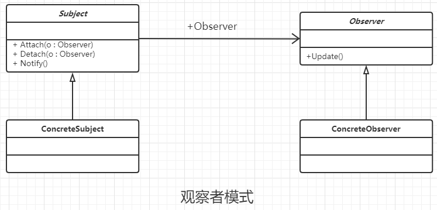

### 观察者模式

#### 定义

定义对象间一种一对多的依赖关系，使得每当一个对象改变状态，则所有依赖于它的对象都会得到通知并被自动更新。

ps : JDK已经实现了观察者模式了, observable 就是被观察者类(一个具体的实现类) , Observer 观察者接口

#### 类图



#### 通用代码

```java
/**
 * 被观察者 ，抽象类，模拟
 * <p>
 * 其实JDK中已经提供了 观察者模式了
 * Observable 就是被观察者类(一个具体的实现类)
 * Observer 观察者接口
 * 因此一般可以直接使用了
 */
public abstract class Subject {
    //定义观察者组
    private Vector<Observer> observers = new Vector<Observer>();

    //增加和删除观察者
    public void addObserver(Observer observer) {
        this.observers.add(observer);
    }

    public void delObserver(Observer observer) {
        this.observers.remove(observer);
    }

    //通知方法
    public void notifyObservers() {
        for (Observer observer : observers)
            observer.update(null);
    }
}


/**
 * 具体的被观察实现类，模拟
 * <p>
 * 其实JDK中已经提供了 观察者模式了
 * Observable 就是被观察者类(一个具体的实现类)
 * Observer 观察者接口
 * 因此一般可以直接使用了
 */
public class ConcreteSubject extends Subject {

    //实现具体的业务
    public void doSomething() {
        /**
         * 具体的业务逻辑
         */
        super.notifyObservers();
    }
}


/**
 * 观察者 ，抽象类，模拟
 * <p>
 * 其实JDK中已经提供了 观察者模式了
 * Observable 就是被观察者类(一个具体的实现类)
 * Observer 观察者接口
 * 因此一般可以直接使用了
 */
public interface Observer {
    //实现方法
    public void update(Object obj);
}


/**
 * 具体观察者 ，模拟
 * <p>
 * 其实JDK中已经提供了 观察者模式了
 * Observable 就是被观察者类(一个具体的实现类)
 * Observer 观察者接口
 * 因此一般可以直接使用了
 */
public class ConcreteObserver implements Observer {
    @Override
    public void update(Object obj) {
        System.out.println("接收到消息" + obj);
    }
}


/**
 * 情景类
 */
public class Client {

    public static void main(String[] args) {
        ConcreteSubject concreteSubject = new ConcreteSubject();
        //添加观察者
        concreteSubject.addObserver(new ConcreteObserver());
        //具体实现
        concreteSubject.doSomething();
    }
}
```

#### 优点

- 观察者和被观察者之间是抽象耦合的
- 建立一套触发机制。 因为一些条件而而导致的蝴蝶效益。

#### 缺点

- 需要考虑效率问题，多个观察者之间一般是顺序执行的，如果一个卡壳，就能影响执行效率。
- 当一个观察者 即使观察者 也是 被观察者的 时，就需要非常注意广播链问题了。

#### 使用场景

- 关联行为场景。 关联行为是可拆分的，而不是 组合 关系。
- 事件多级触发场景。
- 跨系统的消息交换场景，比如消息队列的处理机制。