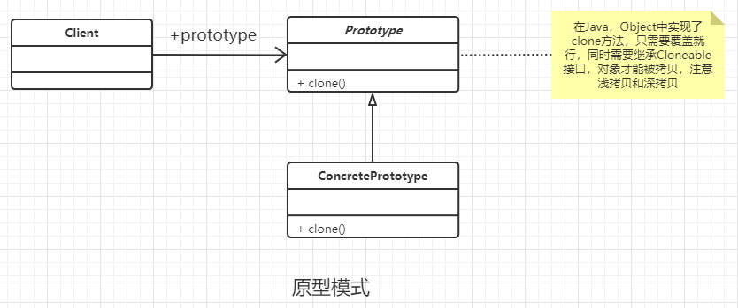

### 原型模式

#### 定义

用原型实例指定创建对象的种类，并且通过拷贝这些原型创建新的对象。

#### 类图



#### 通用代码

```java
/**
 * 按照道理来说，抽象出一个接口，改接口有一个clone方法
 * 子类负责实现该clone接口。但是由于JDK中，Object对象
 * 已经实现了clone方法，并且只需要继承Cloneable ，复写
 * clone方法，jdk就会自动克隆对象
 */
public class ConcretePrototype implements Cloneable {

    @Override
    public ConcretePrototype clone() {
        try {
            return (ConcretePrototype) super.clone();
        } catch (CloneNotSupportedException e) {
            e.printStackTrace();
            return null;
        }
    }
}
```

#### 优点

- 性能优良， 因为是内存中二进制流的直接拷贝，要比new关键性能更好。
- 逃避构造函数的约束 ， 优点同时也是缺点项。 对象的clone和序列化，反序列化是不会调用构造函数的。

#### 使用创建

- 资源优化场景 。 (比如类初始化需要消耗过多的软件硬件资源)
- 性能和安全性要求。（对内存中二进制流的拷贝更加快）
- 一个对象多个修改者的场景。这种情况下，可以考虑使用原型模式。