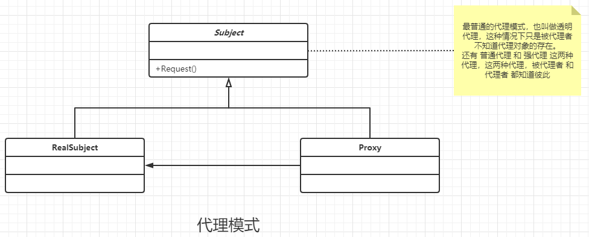
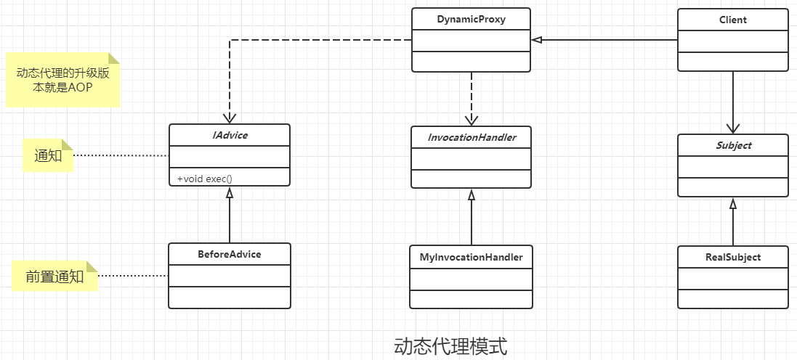

### 代理模式

#### 定义

为其他对选对象提供一种代理以控制对这个对象的访问。

#### 其他概念

通明模式 : 被代理者 不需要知道 代理者的存在， 代理者 一定要知道 被代理者 存在。

普通代理 : 就是被代理者 要知道 代理者的存在(代理者和被代理者双方都是知道彼此的存在)， 并且客户端只能访问代理角色，不能访问真实角色。

强代理 : 是通过 被代理者 指定的 代理者 来访问 被代理者 的方法(代理者和被代理者双方都是知道彼此的存在)。客户端不能通过 其他代理者 和 被代理者 来访问 被代理者的方法。

强代理 和 普通代理 很多相似的地方， 代理者和被代理者双方都是知道彼此的存在， 但是 强制代理 的标志是 被代理者 必须通过 指定代理者 才能访问，其他代理者 或者 被代理者本身 都不能调用自己的方法。

#### 类图

##### 普通代理模式



 ##### 动态代理类图




#### 通用代理

##### 普通代理

```java
/**
 * 普通的动态代理  通用的代码样例
 * 接口，分别实现该接口的 被代理者 和 代理者
 */
public interface Subject {
    //特定的逻辑
    public void request();
}


/**
 * 被代理者
 */
public class RealSubject implements Subject {
    @Override
    public void request() {
        //to do something
    }
}


/**
 * 代理者， 代理者必须知道被代理者
 */
public class ProxySubject implements Subject {
    private Subject realSubject ;

    public ProxySubject(Subject realSubject) {
        this.realSubject = realSubject;
    }
    //其实是委派给 被代理者 实现的
    @Override
    public void request() {
        this.realSubject.request();
    }
}


/**
 * 简单使用
 */
public class Client {
    public static void main(String[] args) {
        Subject proxySubject = new ProxySubject(new RealSubject());
        proxySubject.request();
    }
}

```


#### 动态代码

```java
/**
 * 动态代理， 业务处理类 和 实际的代理类分类，实际的代理其实动态生成， 实际的代理 有一个 InvocationHandler 实例
 * 而 InvocationHandler 实例 持有以 被代理者的实例。调用的过程就是 动态代理者 调用 InvocationHandler ，而 InvocationHandler 将方法
 * 分给 被代理者 执行
 *
 * jdk 自带的 动态代理，要求 被代理者 必须是某个接口的实现，也就是只能代理接口，原因猜测是: 接口实现比较加单，接口只能接口，不用考虑抽象类 和 实际类
 * 这样就会减少非常多的 类型 查找 抽象方法的实现，提高性能。
 */
public interface Subject {
    //模拟业务逻辑
    public void doSomething(String str);
}


/**
 * 真实的业务角色
 */
public class RealSubject implements Subject {
    //真实的处理场景
    @Override
    public void doSomething(String str) {
        //to do
    }
}


/**
 * 动态代理的 的  InvocationHandler , 是联系 被代理者 和 代理者 之间的桥梁
 * 必须持有 被代理者实例才行
 */
public class MyInvocationHandler implements InvocationHandler {
    //被代理者 实例
    private Subject realSubject;

    public MyInvocationHandler(Subject realSubject) {
        this.realSubject = realSubject;
    }

    /**
     *  参数说明一下
     *  proxy其实是 代理者 实例 ，
     *
     *  method 实际要调用的方法
     *
     *  args 方法调用需要的实参
     */
    @Override
    public Object invoke(Object proxy, Method method, Object[] args) throws Throwable {
        return method.invoke(this.realSubject,args);
    }
}


/**
 * 通知
 */
public interface IAdvice {
    //一般只有一个方法
    public void exec();
}

/**
 * 前置通知，一般还会有一个后置的通知
 */
public class BeforeAdvice implements IAdvice {
    @Override
    public void exec() {
        //to do
    }
}


/**
 * 代理实例 创建的地方
 */
public class DynamicProxy<T> {
    //原始版本的,需要传入多个参数
    public static <T> T newProxyInstance(ClassLoader classLoader, Class<?>[] interfaces,
                                         InvocationHandler invocationHandler) {
        //检验是否符合连接点表达式，其实在 InvocationHandler 也可以有连接点
        if (true) {
            //执行前置的通知
            new BeforeAdvice().exec();
        }

        //生成代理对象
        return (T) Proxy.newProxyInstance(classLoader, interfaces, invocationHandler);
    }

    //简化版本的,只是传入一个参数
    public static <T> T newProxyInstance(Subject realSubjct) {
        //检验是否符合连接点表达式，其实在 InvocationHandler 也可以有连接点
        if (true) {
            //执行前置的通知
            new BeforeAdvice().exec();
        }
        //获取加载器 和 接口集合
        ClassLoader classLoader = realSubjct.getClass().getClassLoader();
        Class<?>[] interfaces = realSubjct.getClass().getInterfaces();
        //生成一个 InvocationHandler
        InvocationHandler invocationHandler = new MyInvocationHandler(realSubjct);
        //生成代理对象
        return (T) Proxy.newProxyInstance(classLoader, interfaces, invocationHandler);
    }

}

/**
 * 高层代码
 */
public class Client {

    public static void main(String[] args) {
        Subject proxy = DynamicProxy.newProxyInstance(new RealSubject());
        proxy.doSomething("hahha");
    }
}
```


#### 优点

- 职责清晰 : 将本职业务 与 其他 业务分离开来
- 高扩展性 : 扩展十分的方便， 不管真实业务类发生什么逻辑修改，只要方法接口不变，上层就不用修改

#### 使用场景

最经典就是Spring AOP的例子。