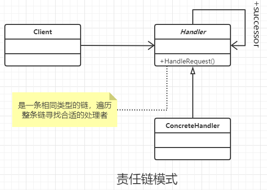

### 责任链模式

#### 定义

使多个对象都有机会处理请求，从而避免了请求的发送者和接受者之间的耦合关系。将这些对象连成一条链，并沿着这条链传递该请求，直到有对象处理它为止。

#### 类图



#### 通过代码

```java
/**
 * 身份标识类,具体业务具体实现,不要拘泥于形式
 */
public class Level {
}


/**
 * 请求类,具体业务具体实现,不要拘泥于形式
 */
public class Request {

    public Level getRequestLevel(){
        return null;
    }
}


/**
 * 回应处置类,具体业务具体实现,不要拘泥于形式
 */
public class Response {
}


/**
 * 责任链模式的核心，就是需要一直传递，直到找到对应的数据项位置
 * 因此有融合部分的方式模板模式
 */
public abstract class Handler {
    private Handler nextHandler;

    //设置级别
    protected abstract Level getHandlerLevel();

    //设置下一个处理者
    public void setNextHandler(Handler nextHandler) {
        this.nextHandler = nextHandler;
    }

    //设置响应
    protected abstract Response echo(Request request);

    //处理者必须对请求进行处理
    public final Response handleMessage(Request request) {
        Response response = null;
        //判断是否是自己级别能处理的
        if (this.getHandlerLevel().equals(request.getRequestLevel()))
            response = this.echo(request);
        else {
            if (this.nextHandler != null) {
                response = this.nextHandler.handleMessage(request);
            } else {
                //处理没有接受者的情况
            }
        }
        return response;
    }

}


/**
 * 具体的处理类
 */
public class ConcreteHandlerA extends Handler {
    //标志自己的登记
    @Override
    protected Level getHandlerLevel() {
        return null;
    }

    //自定义的处理逻辑
    @Override
    protected Response echo(Request request) {
        return null;
    }
}


/**
 * 具体的处理类
 */
public class ConcreteHandlerB extends Handler {
    //标志自己的登记
    @Override
    protected Level getHandlerLevel() {
        return null;
    }

    //自定义的处理逻辑
    @Override
    protected Response echo(Request request) {
        return null;
    }
}


public class Client {

    public static void main(String[] args) {
        Handler handlerA = new ConcreteHandlerA();
        Handler handlerB = new ConcreteHandlerB();
        handlerA.setNextHandler(handlerB);
        handlerA.handleMessage(new Request());
    }
}


```

#### 优点

- 请求者 和 处理者 解耦。
- 增加处理中方便

#### 缺点

- 性能问题，当链表长度比较长时，性能会下降。 需要注意限制长度。
- 调试不方便。