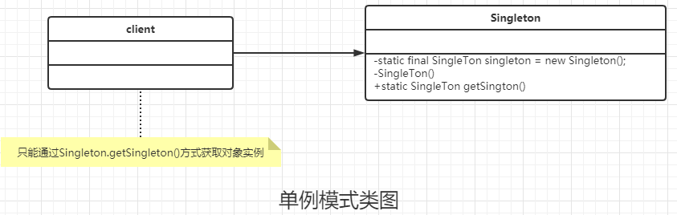

### 单例模式

#### 定义

确保某一个类只要一个实例，并且自行实例化并且整个系统提供整个实例。

#### 类图



#### 通用代码

```java
public class Singleton {
    private static final Singleton singlton = new Singleton();

    //构造函数私有化
    private Singleton() {

    }

    //外界获取该对象的方式
    public static Singleton getSinglton() {
        return singlton;
    }

    //其他业务处理逻辑，尽量是static的
    public static void doSomething() {
        //to do
    }
}
```

#### 优点

- 单例模式内存中只有一个实例，减少了内存的开销。
- 单例模式只是生成一个实例，减少了系统的性能开销。(*当一个对象的创建需要比较多的资源时，如读取配置文件，生成其他依赖对象，使用单例可以很好的系统性能*)
- 可以避免对资源的多重占用。(例如文件的操作)

#### 缺点

- 单例模式一般没有借口，扩展困难。
- 单例模式与单一职责原理冲突。
- 单例模式测试，在并发环境下测试比较麻烦

#### 使用场景

- 请求生成唯一的序列号环境。
- 在整个项目中需要生成一个共享访问点  或者 共享数据。(*ps:web页面的计数器*)
- 当创建一个对象需要 消耗的资源过多。IO和数据库操作。


