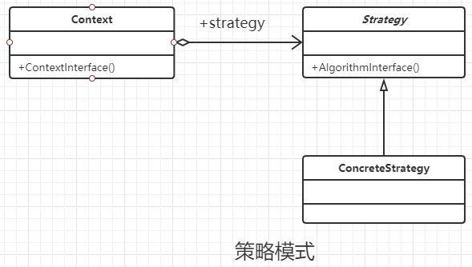

### 策略模式

#### 定义

定义一组算法，将每个算法都封装起来，并且使他们之间可以互换。

#### 类图



#### 通用代码

```java
/**
 * 抽象的策略接口
 */
public interface Strategy {
    //模拟策略的运算法则
    public void exection();
}


/**
 * 具体的策略A
 */
public class ConcreteStrategyA implements Strategy {
    @Override
    public void exection() {
        System.out.println("策略A执行了");
    }
}


/**
 * 具体的策略A
 */
public class ConcreteStrategyB implements Strategy {
    @Override
    public void exection() {
        System.out.println("策略B执行了");
    }
}


/**
 * 策略的 上下文类
 */
public class Context {
    //策略成员
    private Strategy strategy;

    public Context(Strategy strategy) {
        this.strategy = strategy;
    }

    public void setStrategy(Strategy strategy) {
        this.strategy = strategy;
    }

    public void action() {
        this.strategy.exection();
    }
}


/**
 * 客户端
 */
public class Client {
    public static void main(String[] args) {
        //申明上下文
        Context context = new Context(new ConcreteStrategyA());
        context.action();
        //执行另一个策略
        context.setStrategy(new ConcreteStrategyB());
        context.action();
    }
}

```

#### 优点

- 算法可以自由切换
- 避免使用多重条件判断
- 扩展性良好

#### 缺点

- 策略类增多
- 策略类需要对外暴露(可以通过其他模式结合使用解决这个文件)

#### 使用场景

- 多个类只有在算法或者行为上稍有不同
- 算法需要自由切换的场景
- 需要屏蔽算法规则的场景

