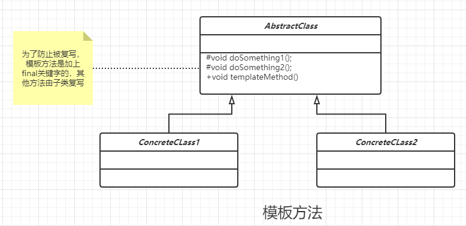

### 模板方法

### 定义

定义一个操作中的算法的的框架，而将一些步骤延迟到子类中，使得子类可以不改变一些算法的结构即可重定义该算法的某些特定步骤。

#### 类图



#### 通用代码

```java
/**
 * 定义通用的抽象方法
 */
public abstract class AbstractTemplateMethodClass {
    //基本方法
    protected abstract void doSomething();

    //基本方法
    protected abstract void doAnything();

    //模板方法。为了防止恶意修改，一般加上final关键字
    public final void templateMethod() {
        /**
         * 调用基本方法，完成相关逻辑
         */
        this.doAnything();
        this.doSomething();
    }
}

/**
 * 具体实例A
 */
public class ConcreteTemplateMethodClassA extends AbstractTemplateMethodClass {
    @Override
    protected void doSomething() {

    }

    @Override
    protected void doAnything() {

    }
}

/**
 * 具体实例A
 */
public class ConcreteTemplateMethodClassB extends AbstractTemplateMethodClass {
    @Override
    protected void doSomething() {

    }

    @Override
    protected void doAnything() {

    }
}


public class Client {
    public static void main(String[] args) {
        AbstractTemplateMethodClass templateMethodClassA = new ConcreteTemplateMethodClassA();
        AbstractTemplateMethodClass templateMethodClassB = new ConcreteTemplateMethodClassB();

        templateMethodClassA.templateMethod();
        templateMethodClassB.templateMethod();
    }
}


```

#### 优点

- 封装不变部分，扩展可变部分。父类负责不变的部分，子类负责可变部分

- 提供公共部分代码，便于维护。
- 行为由父类控制，子类实现

#### 缺点

- 使得代码阅读难度加大

#### 使用场景

- 子类有公有的方法，并且逻辑基本相同。
- 重要，复杂算法，可以核心算法设计成模板方法，细节有子类实现。