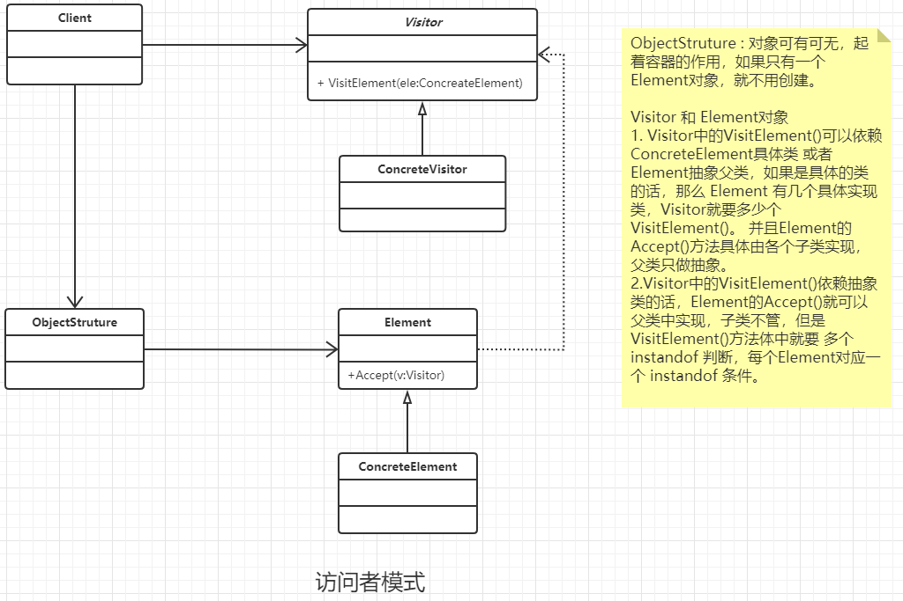

### 访问者模式

#### 定义

封装一些作用于某种数据结构中各个元素的操作，它可以在不改变数据结构的前提下定义作用于这些元素的新操作。

#### 类图



#### 通用代码

```java
/**
 * 抽象的元素类,
 *
 * Visitor 和 Element对象
 * 1. Visitor中的VisitElement()可以依赖ConcreteElement具体类 或者 Element抽象父类，
 * 如果是具体的类的话，那么 Element 有几个具体实现类，Visitor就要多少个VisitElement()，
 * 并且Element的Accept()方法具体由各个子类实现，父类只做抽象。
 * <p>
 * 2.Visitor中的VisitElement()依赖抽象类的话，Element的Accept()就可以父类中实现，子类不管，
 * 但是VisitElement()方法体中就要 多个 instandof 判断，每个Element对应一个 instandof 条件。
 */
public abstract class Element {
    //定义业务逻辑
    public abstract void  doSomething();
    //允许谁来访问
    public abstract void accept(IVisitor iVisitor);
}


/**
 * 具体的元素类型，实现自生特有的逻辑
 */
public class ConcreteElementB extends Element {

    @Override
    public void doSomething() {

    }

    @Override
    public void accept(IVisitor iVisitor) {
        iVisitor.visit(this);
    }
}


/**
 * 具体的元素类型，实现自生特有的逻辑
 */
public class ConcreteElementA extends Element {

    @Override
    public void doSomething() {

    }

    @Override
    public void accept(IVisitor iVisitor) {
        iVisitor.visit(this);
    }
}


/**
 * 抽象访问者，
 * 1. Visitor中的VisitElement()可以依赖ConcreteElement具体类 或者 Element抽象父类，
 * 如果是具体的类的话，那么 Element 有几个具体实现类，Visitor就要多少个VisitElement()，
 * 并且Element的Accept()方法具体由各个子类实现，父类只做抽象。
 * <p>
 * 2.Visitor中的VisitElement()依赖抽象类的话，Element的Accept()就可以父类中实现，子类不管，
 * 但是VisitElement()方法体中就要 多个 instandof 判断，每个Element对应一个 instandof 条件。
 */
public interface IVisitor {
    //每个元素都要有一个访问方法
    public void visit(ConcreteElementA elA);
    public void visit(ConcreteElementB elB);
}


/**
 * 具体的访问者实现类
 */
public class ConcreteVisitor implements IVisitor {
    @Override
    public void visit(ConcreteElementA elA) {
        elA.doSomething();
    }

    @Override
    public void visit(ConcreteElementB elB) {
        elB.doSomething();
    }
}


/**
 * 具体元素生成器
 */
public class ObjectStruture {
    public static Element createElement() {
        if (RandomUtils.nextInt(100) > 50)
            return new ConcreteElementA();
        else
            return new ConcreteElementB();
    }
}


public class Client {
    public static void main(String[] args) {
        for (int i = 0; i < 10; i++)
            //创建对象并且接受访问者
            ObjectStruture.createElement().accept(new ConcreteVisitor());
    }
}
```

#### 优点

- 符合单一职责原则， 元素类 和 访问者类逻辑分离
- 优秀的扩展性 和灵活性。增加数据的操作非常的快捷。

#### 缺点

- 元素细节对访问者公布。
- 具体元素表更比价困难。

#### 使用场景

- 对象结构包含喝多类对象，并且每个对象都有不同的接口，这种情况下，迭代器模式已经不适合使用了。
- 需要对一个对象结构中的对象进行很多不同而且不相关的操作，避免这些操作污染对象的类。